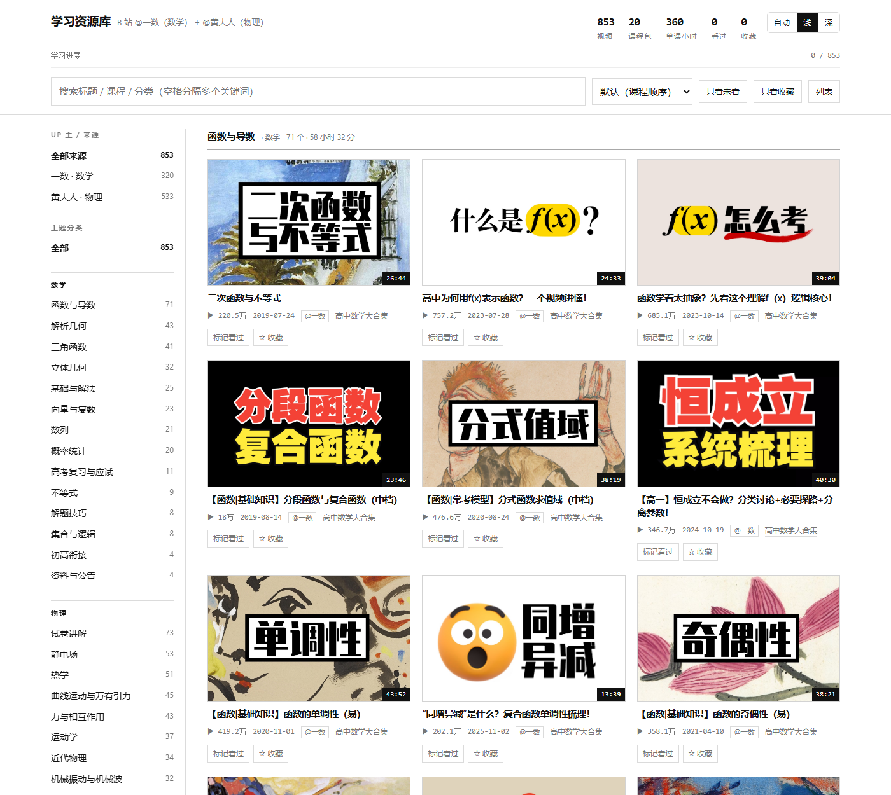
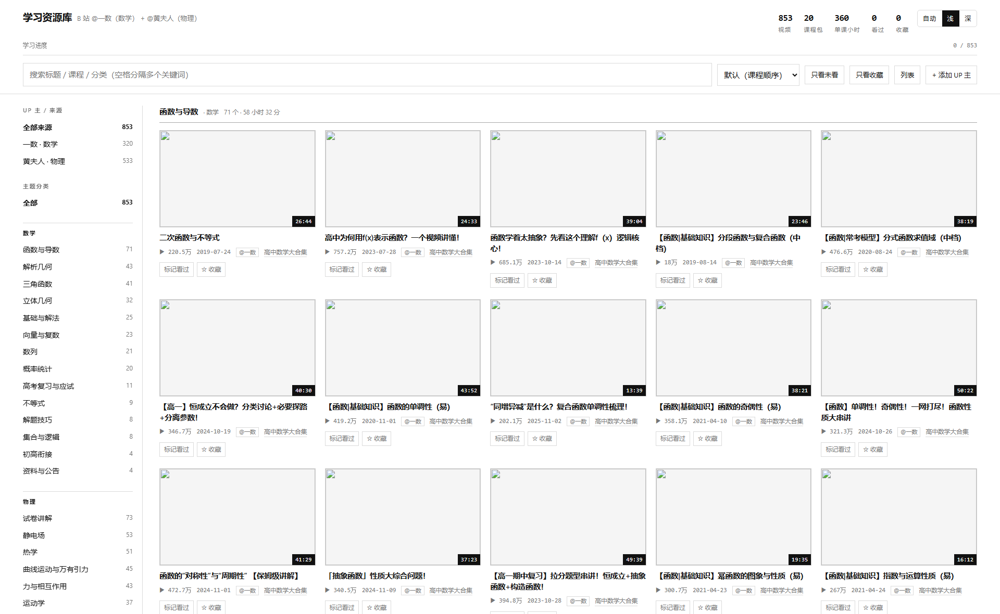
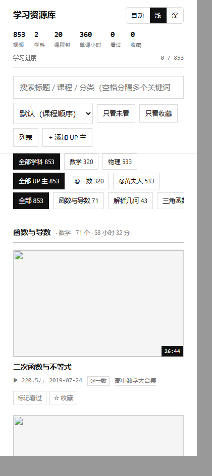
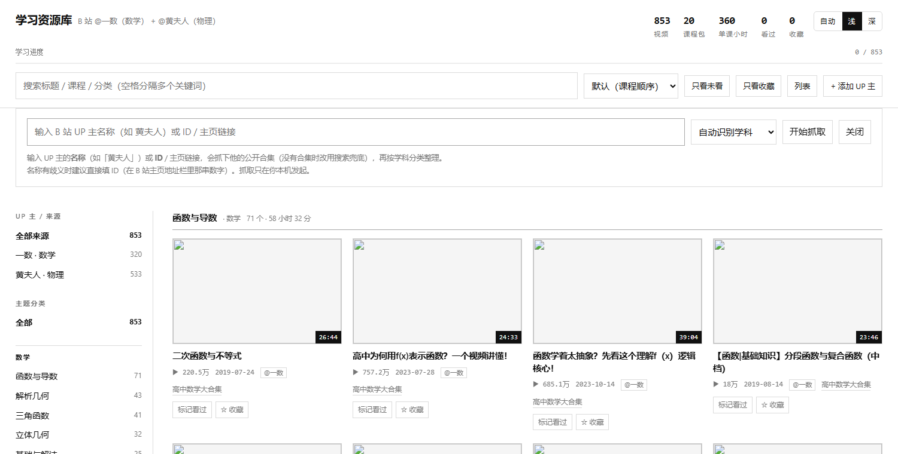
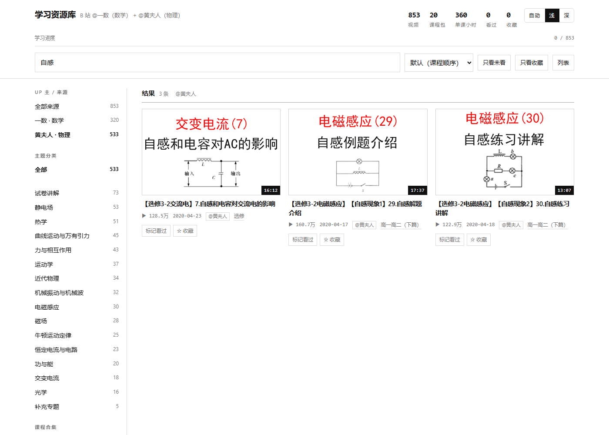
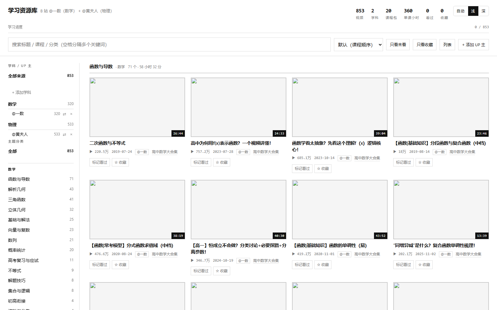
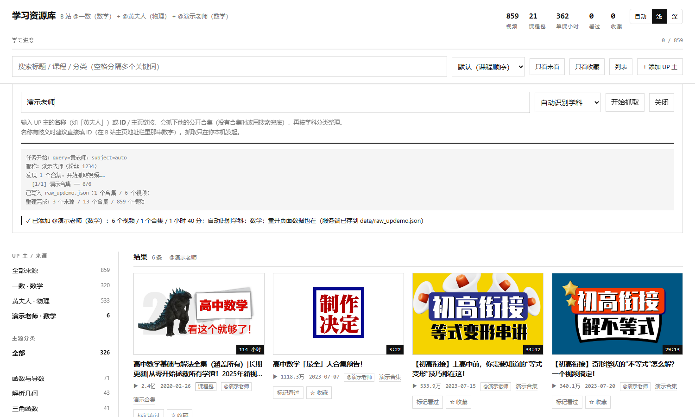

# 📚 学习资源库 · resource-lab

一个用来**收藏整理网课等学习资源**的网站：极简黑白界面、可切换主题，把散落在 B 站的学习视频
按「**学科 → UP 主 → 课程合集 → 知识点**」四层整理，支持搜索、筛选、排序，以及记录"看过 / 收藏"。
还能在网页里**直接输入 B 站 UP 主名称或 ID**，由本地服务现抓现整理（自动识别学科并分类），
导入的 UP 主可以随时改学科或删除。

当前 demo 收录 **三位 UP 主、24 个课程合集、1244 个视频**，全部真实抓取：

| 来源 | 学科 | 合集 | 视频 | 时长 |
| --- | --- | --- | --- | --- |
| [@一数](https://space.bilibili.com/14229967) | 数学 | 7 | 320 | 1894 小时（含 20 个超长课程包） |
| [@黄夫人](https://space.bilibili.com/23630128)（HuangFuRen） | 物理 | 5 | 533 | 151 小时 |
| [@一化儿](https://space.bilibili.com/1526560679) | 化学 | 12 | 391 | 386 小时 |



---

## 两种打开方式

**① 只看已整理好的数据（不需要服务器、不需要联网）**

```powershell
start resource-lab\index.html          # 双击也行
```

数据打包在 `data/resources.js` 里，封面图从 B 站 CDN 加载。文件打开时 `fetch` 会被浏览器拦住，
所以数据用 `<script>` 引入 —— 这是为了让"双击就能看"成立。

**② 想自己输入 UP 主名称/ID 让它现抓（需要一个本地服务）**

```powershell
cd resource-lab
python serve.py                        # 默认 http://127.0.0.1:8765
```

浏览器打开它打印的地址，点右上角 **「+ 添加 UP 主」**，输入名称（如 `黄夫人`）或 ID / 主页链接即可。
详见下面「在网页里加新 UP 主」。

> 浏览器直接打开本地网页时受同源策略限制，没法带 cookie 去请求 B 站，所以"自动抓取"必须有一个
> 本地服务来转发。这也是为什么会有 `serve.py`。

PC 端界面**铺满整个浏览器宽度**（侧栏固定 230px，卡片自适应列数，不居中收窄）。




---

## 界面与功能

| 功能 | 说明 |
| --- | --- |
| **主题** | 右上角「自动 / 浅 / 深」圆角切换器，跟系统或手动指定，选择记在本机 |
| **学科分类** | 内置 **语文 / 数学 / 英语 / 物理 / 化学 / 生物 / 历史 / 政治 / 地理 + 其他**，还能**自己加学科** |
| **按学科分 UP 主** | 侧栏是「学科 → 该学科下的 UP 主」两级；每个 UP 主右边有 `⇄ 改学科` 和 `× 删除` |
| **来源筛选** | 点学科看整科，点 UP 主看一个人；手机上是一排可横滑的标签 |
| **主题分类** | 按知识点分，并**按学科分组**；切到某个学科/UP 主时只显示相关的类 |
| **课程合集** | 保留 UP 主的原始课程组织（高中数学大合集 188 集、选修 134 集…），同名不同来源会标出作者 |
| **搜索** | 标题 / 课程 / 分类 / 标签 / **作者**全文匹配，空格分隔多个关键词（AND） |
| **排序** | 默认（课程顺序）/ 播放量 / 时长 / 最新 |
| **视图** | 卡片 / 列表切换 |
| **学习状态** | 每条可以「标记看过 / ☆收藏」，顶部有总进度条；还能「只看未看 / 只看收藏」 |
| **添加 UP 主** | 右上角「+ 添加 UP 主」：输入 B 站名称 / ID / 主页链接，服务端现抓、自动分类，抓完前端立刻并入当前页面 |
| **快捷键** | 按 `/` 直接跳到搜索框 |





### 学科 / UP 主 管理



侧栏第一组就是「学科 / UP 主」，两级结构：

```
学科 / UP 主
  全部来源                853
  数学                    320
      @一数        320  ⇄ ×
  物理                    533
      @黄夫人      533  ⇄ ×
  信息技术                  0        ← 自己加的学科，哪怕还没 UP 主也留着
      （还没有 UP 主）
  + 添加学科
```

- **内置 9 科**：语文 / 数学 / 英语 / 物理 / 化学 / 生物 / 历史 / 政治 / 地理（+ 其他）。
  只有"有视频"的学科会显示在侧栏，避免一排空学科刷屏（下拉框里 9 科都在）。
- **自己加学科**：点「+ 添加学科」输入名字即可。落盘在 `data/subjects.json`，
  重启/刷新都在；抓 UP 主时可以在下拉框里直接选它（显示成「按信息学整理（自定义）」）。
  自定义学科**可以删除**（侧栏学科名右边的 ×）；内置学科不给删。
- **改学科**：点 UP 主右边的 `⇄`，出现学科下拉框，选完即生效（服务器重建数据）。
  内置来源（一数/黄夫人）同样可以改 —— 比如把黄夫人临时归到别的科。
- **删除 UP 主**：点 `×` → 行内出现「删除 @一数？确认 / 取消」二次确认。
  确认后原始数据文件会被**软删除**到 `data/trash/<文件名>.<时间戳>`（可以手工恢复），
  数据集重建、页面刷新。删光了也行（会得到一个空数据集，学科表还在）。
- 还有学科在用的时候删该学科会被拒绝（HTTP 409），错误信息里会列出还在用的 UP 主 ——
  不会静默把你的数据改掉。

学科归属关系记在 `data/sources.json`（`{mid: {id, name, subject_id, subject}}`），
自定义学科记在 `data/subjects.json`；两者都由 `serve.py` 维护，重建时一并传给
`build_resources.build(..., source_overrides=..., extra_subjects=...)`。

> 自动识别学科的能力：数学/物理的规则表是按各自知识体系手写的（细），
> 另外 7 科是**粗粒度关键词表**（够认出"这个 UP 主讲化学"和做基本归类）。
> 所以自动识别只在**这 9 科**里选，自定义学科不会被自动认出来 —— 它靠你手动指定。


### 不同学科 / 不同 UP 主怎么区分开

四层隔离，不会混在一起：

1. **学科**：内置 9 科 + 自定义学科，侧栏按学科分组，点学科只看整科；
2. **来源筛选**：选「@一数」就只看数学的 320 个，选「@黄夫人」就只看物理的 533 个；
3. **分类按学科隔离**：分类 id 带学科前缀（`math:hanshu` / `physics:dianci`），
   各科关键词规则完全不同 —— 数学用"函数/导数/圆锥曲线"，物理用"电磁感应/安培力/理想气体"；
4. **卡片带作者标**：每张卡片的元信息里都有 `@一数` / `@黄夫人`；
   课程合集的 id 也带来源前缀（`yishu:1533671`），同名不会撞。

数据层同样隔离：每条视频都有 `source_id` / `author` / `subject_id` / `subject` 字段，
`courses` / `categories` 的 id 都带命名空间前缀。

### 「课程包」是什么

数据里有两种量级完全不同的东西：

- **单课视频**（一数 300 个 + 黄夫人 533 个）：一节课一个知识点，`26:44` 这种时长；
- **课程包**（一数 20 个，单个视频 3 小时以上，最长 **113 小时**）：像《高中数学基础与解法全集》
  《一本通》《必刷100讲》这种把整本教材讲完的超长视频。

所以卡片角标会把课程包标成 `114 小时` + 「课程包」，顶部统计只把单课算进"单课小时"，
避免"2045 小时"这种数字误导判断。

---

## 在网页里加新 UP 主（自动抓取）

```powershell
python serve.py                 # 默认只监听 127.0.0.1:8765，被占用会自动往后试端口
python serve.py --open          # 顺便打开浏览器
python serve.py --host 0.0.0.0  # 让局域网也能访问（会打印安全警告）
```

然后在页面里点「+ 添加 UP 主」，填**名称、ID 或主页链接**，流程是：

1. **解析 UP 主**：数字/链接直接当 mid；名字走 B 站搜索接口，优先"完全同名"，否则取出现次数最多的作者，
   并把前几名候选记在结果里（名称有歧义时建议直接填 ID）；
2. **抓取合集**：复用 `crawl_bilibili.py` 的合集接口，逐页抓取并实时把日志推给前端；
   - 如果这个 UP 主**没有公开合集**，自动改用**搜索兜底**（按名字搜、只留该作者的视频），
     并明确标注"不保证完整"；
3. **自动识别学科**：拿标题去已有的规则表打分（数学 / 物理 / 其他），命中率最高的胜出；
   你在下拉框里手动指定的话以你为准；
4. **写入 + 合并**：原始数据存成 `data/raw_<slug>.json`，学科选择记进 `data/sources.json`，
   并重建 `data/resources.json|js`；同时把结果**立刻并进当前页面**（不刷新就能看到，自动切到新来源）。

界面上的进度条、阶段（解析 UP 主 → 抓取合集 → 分类整理 → 写入数据）和爬取日志都是实时的；
一次只允许跑一个任务（第二个请求会收到 409），任务状态只在内存里（重启丢，但数据已经落盘）。



实测（真实联网，`serve.py` 跑在本机）：
- 输入 ID `14229967` → 6.1 秒抓完 7 个合集 / 320 个视频，`via=mid`，并正确取到昵称「一数（粉丝 26225092）」；
- 输入名字 `一数` → 5.1 秒，`via=search-exact`（完全同名优先）；
- 输入 ID `23630128` → 8.2 秒，5 个合集 / 533 个视频，自动识别学科为物理；
- 抓完数据集仍是 2 个来源、853 个视频 —— 重复抓同一个 UP 主是**替换**而不是翻倍。

> 抓取会真的对外发起 B 站请求，默认只监听本机；`--host 0.0.0.0` 时局域网里任何人都能触发抓取，
> banner 里会警告。

### 前端"即时合并"凭什么可信

网页里抓完后不刷新就显示结果，靠的是前端自己按视频重新汇总分类/课程/统计 —— 这就有"前端一套算法、
后端一套算法"对不上的风险。所以：

- 前端那套聚合逻辑抽在 `index.html` 的 `/* === CORE:START/END === */` 块里；
- `test_core.mjs` 会把它抠出来，**拿真实的 `data/resources.json` 反过来验算**：
  JS 重算出的分类、课程、来源统计、全局统计必须与 Python 产出的**逐字段完全一致**。

这个测试第一次跑就抓到过一处真实口径差异（整小时时 Python 不显示"0 分"，JS 多显示了），已修。

---

## 数据是怎么来的

```powershell
cd resource-lab
# 1) 抓一数（数学）
python crawl_bilibili.py
# 2) 抓黄夫人（物理）
python crawl_bilibili.py --mid 23630128 --author HuangFuRen --out data/raw_huangfuren.json
# 3) 合并 + 分类 + 汇总（默认自动扫描 data/raw_*.json，和 serve.py 的重建口径一致）
python build_resources.py
```

- **爬虫**只用了两个 B 站公开接口：合集列表 `seasons_series_list`、合集内视频
  `seasons_archives_list`（UP 主的投稿接口有新版反爬，403/412，刻意避开）。
  中文查询需要先拿 `buvid3` cookie（首页 + `/x/frontend/finger/spi`），否则会被风控返回 412 ——
  这段逻辑在 `crawl_bilibili.py` 里，同时带请求间隔、重试退避、失败降级
  （某页失败只标记该合集 `truncated`，已有数据不丢）和 `--offline-cache` 离线复跑。
- **实测抓取**：一数 7 合集 / 320 视频 / 4.02 秒；黄夫人 5 合集 / 533 视频 / 6.21 秒；全程无 412、无截断。
- 数据是**时间点快照**，播放量和集数会变，重跑即可刷新。

### 分类是怎么分的

`build_resources.py` 里有两张**关键词规则表**（数学、物理），判定顺序是：

1. **先看标题开头的【方括号】**（UP 主的标题里这里最可信，通常是章节/系列名）；
2. 再退回**整标题关键词**匹配；
3. 都没命中才进「其他」。

规则表从上往下第一个命中生效，所以"越具体的规则放越前面"。真实标题上踩过的坑（都写进了测试）：

- `三角函数` 必须排在 `函数与导数` 前面，否则"三角**函数**"会被抢走；
- 物理里 `电磁感应` 必须排在 `磁场` 前面 —— "电**磁感应**"里包含"磁感应"；
- `平面向量` 会先被"向量"规则接走，所以 `平面` 可以安全地放进立体几何；
- `【光】` 属于光学，但"**光滑**斜面"是力学，所以"光滑"要放在"力"里（力比光学先匹配）；
- **阶段名不参与方括号匹配**：`【一轮复习】导数专题` 应该进"函数与导数"，
  而不是"高考复习"；`【补充】牛二解释惯性` 应该进"牛顿运动定律"，而不是"补充专题"。

在 853 条真实标题上，**落进「其他」的是 0 条**（有测试守着 10% 红线）。

---

## 项目结构

```
resource-lab/
├── index.html             # 网站本体（单文件：极简黑白 UI + 前端聚合逻辑）
├── serve.py               # 本地服务：静态站点 + 抓取 API（输入 UP 名/ID 自动抓取）
├── crawl_bilibili.py      # 爬虫：合集 + 合集内视频；还能解析 UP 名/ID、搜索兜底
├── build_resources.py     # 多来源合并 + 按学科分类 + 汇总 → data/resources.json / resources.js
├── test_crawl.py          # 爬虫离线测试（13 用例 / 5982 断言）
├── test_build.py          # 分类器 + 构建器 + 学科 + 页面结构（139 断言）
├── test_core.mjs          # 前端聚合口径 vs Python 口径（node，40 断言）
├── test_serve.py          # 服务端接口离线测试（178 断言）
├── data/
│   ├── raw_bilibili.json   # 一数（数学）原始抓取结果
│   ├── raw_huangfuren.json # 黄夫人（物理）原始抓取结果
│   ├── raw_<slug>.json     # 你自己在网页里加的 UP 主
│   ├── sources.json        # 每个 UP 主属于哪个学科（serve.py 维护）
│   ├── subjects.json       # 你自定义的学科（serve.py 维护）
│   ├── resources.json      # 合并后的网站数据（给别的程序用）
│   ├── resources.js        # 同上，包成 window.RESOURCES（给 file:// 用）
│   ├── cache/              # 接口原始响应，--offline-cache 用
│   └── trash/              # 删除 UP 主时的软删除备份（可手工恢复）
└── screenshots/
```

数据格式（`resources.json`，v3）：

```jsonc
{
  "schema": "resource-lab/resources/v3",
  "generated_at_text": "2025-10-04 01:20",
  "sources": [ { "id": "yishu", "name": "一数", "mid": 14229967,
                 "subject_id": "math", "subject": "数学",
                 "space": "https://space.bilibili.com/14229967",
                 "count": 320, "courses": 7, "bundles": 20, "lessons": 300,
                 "duration_text": "1894 小时 17 分" } ],
  "subjects": [ { "id": "chinese", "name": "语文", "builtin": true,
                  "count": 0, "sources": 0, "courses": 0, "duration_text": "0 秒" },
                { "id": "math", "name": "数学", "builtin": true, "count": 320, ... },
                { "id": "custom-17e14c13", "name": "信息技术", "builtin": false, "count": 0, ... } ],
  "stats":   { "total": 853, "courses": 12, "categories": 30, "sources": 2, "subjects": 2,
               "bundles": 20, "lessons": 833, "lesson_duration_text": "360 小时 20 分", ... },
  "categories": [ { "id": "math:hanshu", "name": "函数与导数",
                    "subject_id": "math", "subject": "数学", "count": 71, ... } ],
  "courses":    [ { "id": "yishu:1533671", "title": "高中数学大合集", "source_id": "yishu",
                    "author": "一数", "subject_id": "math", "count": 188, ... } ],
  "videos":     [ { "bvid": "BV...", "title": "...", "url": "...", "cover": "https://...",
                    "duration": 1863, "duration_label": "31:03", "is_bundle": false,
                    "views": 4210000, "date_text": "2024-06-25",
                    "source_id": "yishu", "author": "一数",
                    "subject_id": "math", "subject": "数学",
                    "course_id": "yishu:1533671", "course_title": "高中数学大合集",
                    "category_id": "math:hanshu", "category": "函数与导数",
                    "tags": ["导数", "切线"], "order": 0 } ]
}
```

---

## 测试

```powershell
cd resource-lab
python test_crawl.py      # 爬虫：13 用例 / 5982 断言，全部离线（用 cache 里的真实响应）
python test_build.py      # 分类器 + 构建器 + 学科表 + 页面结构：139 断言
node   test_core.mjs      # 前端聚合口径 vs Python 口径：40 断言
python test_serve.py      # 本地服务 + 抓取/学科/删除接口：178 断言（注入假爬取函数，不联网）
```

`test_build.py` 覆盖：**19 条数学标题 + 21 条物理标题**的分类结果（含所有优先级冲突）、
方括号优先逻辑（含序号前缀、`「」` 括号）、标签提取、时长格式化边界、单课/课程包分界、
**多来源合并**（学科隔离、id 命名空间、每个来源的统计自洽）、脏数据容错
（`null` 合集 / `null` 视频 / 空标题 / 字符串时长 / 非 dict 输入）、输出文件与 CLI、
以及**真实数据自洽性**（bvid 全局唯一、url 与 bvid 匹配、分类计数之和 = 总数、
「其他」占比 ≤ 10%、每个来源的分类只来自自己学科）。

写这些测试抓到过 4 个真 bug：`三角函数` 被 `函数与导数` 抢走、`电磁感应` 被 `磁场` 抢走
（"磁感应"是子串）、合集或视频为 `null` 时构建器崩溃、以及分类漏词导致 20 条掉进「其他」。
`test_core.mjs` 还抓到过一次前后端口径不一致（整小时时"0 分"的显示）。

---

## 已知限制

1. **学科规则详略不一**：数学/物理的规则表是按各自知识体系手写的；另外 7 科是**粗粒度**关键词表，
   够认出"这个 UP 主讲化学"和做基本归类，但分类粒度远不如数学/物理。
   自动识别也**只在这 9 个内置学科里选**，自定义学科只能手动指定。
2. **学科是手写的关键词表，不是语义理解**：加一门"没见过的"学科（比如信息技术、竞赛）时，
   自动识别大概率给「其他」，需要你在下拉框里手选或事后点 `⇄` 改。
3. **删除是软删除**：原始文件移到 `data/trash/`，不会自动清理，久了要自己删；
   删掉内置来源（一数/黄夫人）后要重新抓一次才能恢复。
4. **一个来源对应一个学科**（当前数据如此）；同一 UP 主跨学科讲课的话，需要给来源加
   "按合集判学科"的逻辑。
5. **自动抓取需要本地服务**：`file://` 直接打开时浏览器无法带 cookie 请求 B 站，界面上会给出提示。
   服务默认只监听 `127.0.0.1`；开 `--host 0.0.0.0` 等于把"触发抓取"的能力开放给局域网，banner 里会警告。
6. **没有合集的 UP 主只能搜索兜底**：结果是"能被作者名命中的视频"，不是完整投稿列表，
   界面上会标"不保证完整"。B 站的投稿列表接口有新版反爬，刻意没有去绕。
7. **抓取任务一次只能跑一个**，任务状态在内存里（服务重启后历史任务丢失，但数据已落盘）；
   抓取是同步等 B 站的，超大 UP 主会比较慢（可用 `--max-videos` 限制）。
8. **分类是关键词规则，不是语义理解**：没有关键词的标题会掉到「其他」（当前 0 条，
   换别的 UP 主就会变多）；个别标题可能被分到"沾边但不对"的分类。
9. **封面来自 B 站 CDN（`i0.hdslb.com`）**：断网或防盗链变化时不显示 ——
   代码里做了 `referrerpolicy="no-referrer"` 和加载失败自动隐藏，不会出现碎图。
10. **首屏会一次渲染全部卡片**（853 张，图片懒加载）：数据量再大要考虑分页/虚拟列表。
11. **数据是快照**：播放量、集数、标题都随 UP 主更新变化，`generated_at_text` 记录整理时间。
12. **播放量/时长仅供排序参考**，不代表课程质量排序。
13. **「看过 / 收藏」存在浏览器 localStorage**，换设备或清缓存会丢（没有账号体系）。
14. **B 站接口可能变**：如果那两个 polymer 接口将来也上 wbi 签名，需要按 `crawl_bilibili.py`
    里的说明补签名逻辑。

---

## 可以怎么扩展

- **更多 UP 主 / 学科**：`crawl_bilibili.py --mid` 直接支持；界面里也能直接加。
  想给新学科更好的自动归类，就往 `build_resources.SUBJECT_RULES` 里补关键词
- **学习路径**：按「高一高二 → 一轮复习 → 拔高」生成推荐顺序，而不只是分类
- **定时刷新**：把三条命令挂到计划任务，`generated_at_text` 变了界面提示"有更新"
- **首屏性能**：分类折叠 / 虚拟滚动 / 封面小图（B 站封面支持 `@320w_200h` 这类后缀）
- **导出与联动**：导出"只看未看"清单、生成 B 站收藏夹导入格式、和 note-lab（随手记）打通
- **进度同步**：把"看过/收藏"存到本地文件（配一个几行的本地服务）实现跨设备
